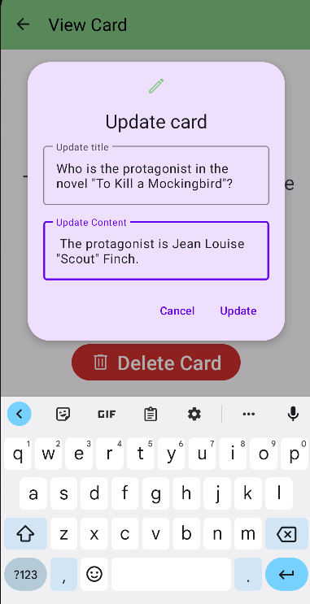
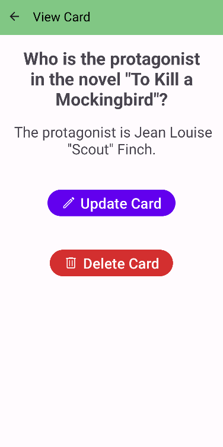

# FlashCard App

The Flashcard Android App is a mobile application that allows users to create, view, update, and delete text-based flashcards.

## Features

- Create and customize text-based flashcards.
- View flashcards with a smooth and intuitive user interface.
- Update and modify the content of existing flashcards.
- Delete flashcards that are no longer needed.

## Images
### Editing a Card

### Viewing a Card

